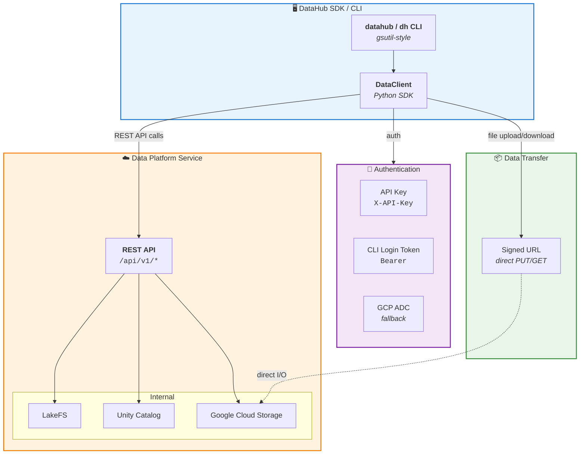
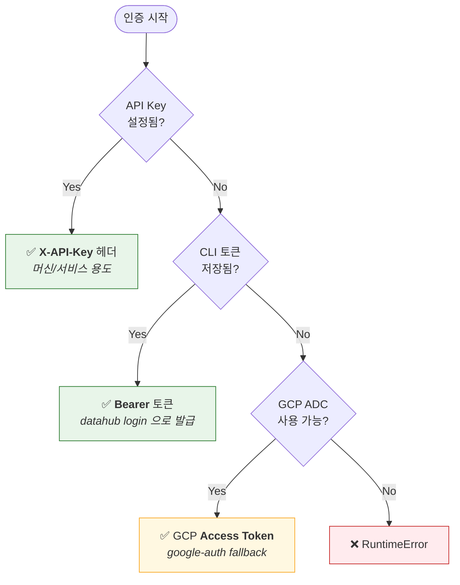
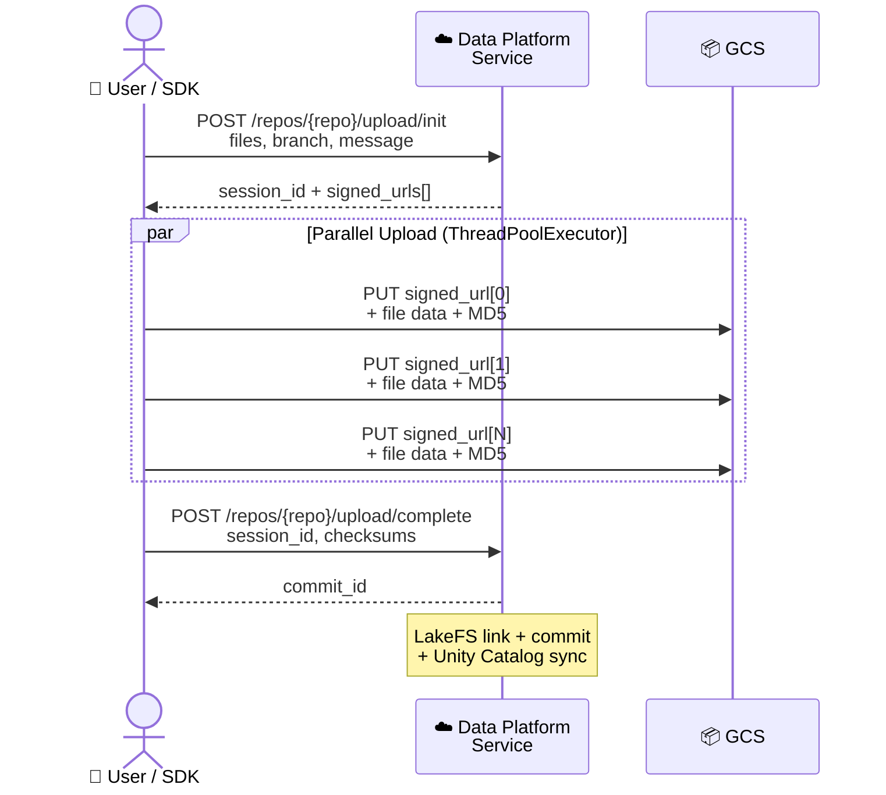
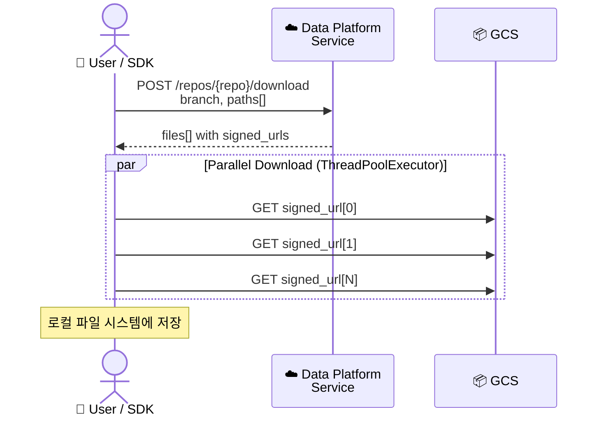
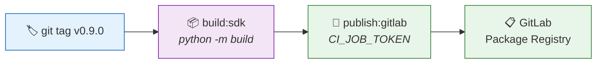

# LGAIR DataHub SDK

## 주요 담당

| 담당자 | 역할 | 커밋 user.name |
|--------|------|---------------|
| 시우 (Siu) | 백엔드 / 오브젝트 스토리지 | `Siu (datahub-storage)` |
| 도윤 (Doyun) | QA / 릴리즈 게이트 | `Doyun (datahub-qa)` |

> 커밋 시: `git config user.name "Siu (datahub-storage)"  # 또는 Doyun (datahub-qa)`


> **LG AI Research Data Platform** — Python SDK & CLI for dataset management

`lgair-datahub`는 Data Platform Service의 thin client SDK입니다.  
LakeFS, Unity Catalog, GCS 등 인프라 의존성 없이, 서버 API만 호출하여 데이터셋을 관리합니다.

---

## Local Development (사내망 없이 개발)

이 섹션은 **사내 VPN/시스템망 없이 개인 PC에서 코드를 수정·테스트**하는 경우를 위한 가이드입니다. 사내 환경에서 실제 서비스에 연결해 사용하려면 아래 [Installation](#installation) 섹션을 따르세요.

### 1. 소스에서 editable 설치

```bash
# 저장소 루트에서
python -m venv .venv && source .venv/bin/activate
pip install -e ".[dev]"
```

`pyproject.toml` 의 기본 의존성에는 사내 패키지가 포함되어 있지 않으므로 외부망(PyPI)만으로 설치 가능합니다.
선택 의존성 중 `[nfs]` 만 사내 GitLab Package Registry 에서 배포되는 `datahub-nfsd-bin` 을 요구하므로 로컬에서는 사용하지 마세요. (`[fuse]` 는 PyPI 의 `fusepy` 라 무관)

### 2. 기본 endpoint

import 시 자동으로 사내 URL 로 향하던 동작은 제거되었습니다. 기본값은 `http://localhost:8000` 이며, 다른 endpoint 를 쓰려면 다음 중 하나로 override 하세요.

```bash
# 환경변수
export DATAHUB_AUTH_ENDPOINT=http://localhost:8000

# 또는 ~/.datahub/config.yaml
cat > ~/.datahub/config.yaml <<'YAML'
auth:
  endpoint: http://localhost:8000
  verify_ssl: false
YAML
```

코드에서 직접 주입할 수도 있습니다:

```python
from datahub import DataClient
client = DataClient(endpoint="http://localhost:8000")
```

### 3. 테스트 실행

E2E 테스트는 라이브 서버를 요구하므로 제외합니다 (단위 테스트는 네트워크 불요):

```bash
pytest tests/ --ignore=tests/e2e
```

### 4. 사내망 의존 항목 (참고)

로컬 개발 시 의도적으로 **건드리지 않는** 사내 결합 지점:

- `.gitlab-ci.yml` — 사내 GitLab CI 전용 (로컬 실행 안 됨)
- `src/datahub/_trust.py` — 사내 TLS 검사 프록시 대응. `truststore` 패키지 미설치 시 silent no-op 이라 로컬 영향 없음
- `tests/e2e/` — 라이브 API 서버 필요 (위에서 `--ignore` 로 제외)

---

## Installation

내부망 GitLab Package Registry에서 설치합니다. Public 레지스트리이므로 **인증 토큰 불필요**.

### CLI 설치 — `uv tool` 권장

`lgair-datahub` 는 CLI(`datahub`/`dh`) 와 SDK 를 모두 제공합니다. **CLI 가 주 용도**라면 일반 `pip install` 대신 **격리 도구 설치 방식** 을 쓰세요. 일반 `pip` 으로 설치하면 conda env / venv / user-site 등 여러 인터프리터에 같은 패키지가 흩어지고, 그 중 하나만 업그레이드되어 옛 버전이 PATH 우선순위로 잡히는 회귀가 자주 발생합니다.

#### `uv tool` (권장)

**왜 `uv tool` 인가** — `uv` 는 자체적으로 Python 인터프리터를 받아 격리 venv 를 만듭니다. 시스템 Python 이 어떤 상태든 (Homebrew `python@3.14` 의 ensurepip 결함, conda env 충돌, 시스템 python 없음 등) **사용자가 Python 버전을 직접 신경쓸 일이 없습니다**.

`uv` 가 없으면 먼저 설치 (한 번만):

```bash
# macOS / Linux — 공식 installer
curl -LsSf https://astral.sh/uv/install.sh | sh
# 또는: brew install uv  (macOS)
```

설치 (이미 깔려있어도 그대로 재실행하면 최신으로 갱신 — `--upgrade` 포함):

```bash
# prd (latest stable) ─ 일반 사용자
uv tool install --upgrade \
  --index https://gitlab.lgresearch.ai/api/v4/projects/883/packages/pypi/simple \
  --allow-insecure-host gitlab.lgresearch.ai \
  lgair-datahub

# dev (develop 브랜치 최신 스냅샷) ─ 내부 개발자
uv tool install --upgrade \
  --index https://gitlab.lgresearch.ai/api/v4/projects/883/packages/pypi/simple \
  --allow-insecure-host gitlab.lgresearch.ai \
  --prerelease=allow \
  lgair-datahub
```

> `--upgrade` 플래그가 있으면 미설치 상태에서는 신규 install, 이미 설치돼 있으면 최신으로 갱신 — **같은 명령이 install 과 upgrade 양쪽 역할**. 새 dev 빌드가 push 될 때마다 위 명령을 그대로 다시 실행하면 됩니다.
>
> uv 가 stable Python (필요 시 자동 다운로드) 으로 격리 venv 를 만듭니다. 시스템 Python 이 깨져있어도 영향 없음.

캐시까지 무시하고 강제 재설치하고 싶으면 `--upgrade` 대신 `--reinstall` 사용 (dependency 까지 모두 다시 받음).

#### `pipx` (대안)

`uv` 를 못 쓰는 환경 (사내 정책 등) 에서는 `pipx` 도 가능합니다. 단, pipx 는 시스템 Python 의존성이 있어 Homebrew `python@3.14` 처럼 ensurepip 가 깨진 빌드를 만나면 `--python <stable>` 명시가 필요합니다.

```bash
brew install pipx && pipx ensurepath        # 또는: sudo apt install pipx

# 설치 또는 갱신 (--force: 이미 깔려있으면 최신으로 덮어씀)
pipx install --force \
  --index-url https://gitlab.lgresearch.ai/api/v4/projects/883/packages/pypi/simple \
  --pip-args="--trusted-host gitlab.lgresearch.ai --pre" \
  lgair-datahub

# `ensurepip` 오류가 나면 (python@3.14 등) — stable Python 명시
pipx install --force --python python3.11 \
  --index-url https://gitlab.lgresearch.ai/api/v4/projects/883/packages/pypi/simple \
  --pip-args="--trusted-host gitlab.lgresearch.ai --pre" \
  lgair-datahub
```

위 명령도 install / upgrade 양쪽 역할을 합니다. `--force` 가 있어 동일 버전이 깔려있어도 최신을 다시 가져옵니다.

#### 설치 후 검증 (필수)

옛 버전이 다른 환경에 잔존하면 PATH 우선순위로 그 쪽이 잡힙니다. 다음 두 줄로 확인:

```bash
which -a datahub                                      # 한 줄(uv tool/pipx 경로)만 나와야 정상
"$(head -1 $(which datahub) | sed 's|^#!||')" -c \
  "import datahub; from datahub._defaults import DEFAULT_ENDPOINT; \
   print(datahub.__version__, DEFAULT_ENDPOINT)"
# 예: 0.11.0.dev160 https://api-dev.datahub.lgair-data.com
```

여러 줄이 나오거나 wheel 의 `DEFAULT_ENDPOINT` 가 의도한 환경과 다르면 [Upgrade / Reinstall](#upgrade--reinstall) 섹션 참고.

#### 다양한 SDK 환경에서 CLI 최신성 유지하기

이 패키지는 **CLI 와 SDK 를 함께 제공** 하므로, 사용자는 보통 다음 두 가지를 동시에 가집니다:

1. **글로벌 CLI** — `uv tool` 로 단 한 번 설치 (위 명령). 모든 셸에서 `datahub login` 동작.
2. **프로젝트별 SDK** — 각 venv 에 `uv add lgair-datahub` (또는 `pip install`). 프로젝트별로 다른 버전을 핀고정하는 게 정상.

이 둘은 **서로 분리되어 있어** SDK 가 여러 환경에 깔려있어도 CLI 의 최신성에는 영향이 없습니다. CLI 만 다음 한 줄로 갱신 — 위 [설치](#uv-tool-권장) 섹션의 명령을 그대로 다시 실행하면 됩니다 (`--upgrade` 포함되어 있어 idempotent):

```bash
uv tool install --upgrade \
  --index https://gitlab.lgresearch.ai/api/v4/projects/883/packages/pypi/simple \
  --allow-insecure-host gitlab.lgresearch.ai \
  --prerelease=allow \
  lgair-datahub

# prd 채널만 쓰면 짧게:
# uv tool upgrade lgair-datahub
```

또는 **영구 install 없이 매 호출마다 최신 dev 빌드를 사용**하려면 `uvx` 사용:

```bash
# 매번 최신 dev 빌드를 받아 실행 (--refresh 가 캐시 무효화)
uvx --refresh --from "lgair-datahub" \
  --index https://gitlab.lgresearch.ai/api/v4/projects/883/packages/pypi/simple \
  --allow-insecure-host gitlab.lgresearch.ai \
  --prerelease=allow \
  datahub login
```

매번 약간의 fetch 지연이 있지만 "버전 갱신을 잊을 일이 없는" 트레이드오프 — 데모/검증 환경에 유용.

### 채널 구분

같은 레지스트리에 **dev / stg / prd** 빌드가 공존합니다. 설치하려는 환경에 맞춰 버전 지정자를 선택하세요.

| 브랜치 | 버전 형식 | 기본 endpoint | 설치 시 버전 지정자 |
|--------|----------|--------------|-------------------|
| `develop` | `0.11.0.devN` | `api-dev.datahub.lgair-data.com` | `"lgair-datahub>=0.11.0.dev0,<0.11.1"` |
| `staging` | `0.11.0rcN` | `api-stg.datahub.lgair-data.com` | `"lgair-datahub>=0.11.0rc0,<0.11.0"` |
| `main` / `v*` 태그 | `0.11.0` | `api.datahub.lgair-data.com` | `lgair-datahub` (latest stable) |

> **주의**: pip/uv 는 기본적으로 pre-release(`.dev`, `rc`)를 무시합니다. dev/stg 빌드를 설치하려면 반드시 `>=X.Y.Z.dev0` 처럼 **pre-release를 명시적으로 포함**하는 specifier 를 사용하거나 `--pre` 플래그를 넘겨야 합니다.
>
> 빌드된 wheel 의 `DEFAULT_ENDPOINT` 는 브랜치별로 다르게 주입되어 있습니다. 다른 환경을 가리켜야 할 땐 `~/.datahub/config.yaml` 의 `auth.endpoint` 또는 `DATAHUB_AUTH_ENDPOINT` 환경변수로 override 하세요.

### SDK 로 프로젝트에 추가하려면 (라이브러리 용도)

CLI 가 아니라 코드에서 `from datahub import DataClient` 로 import 하려면 **프로젝트 venv 에 라이브러리로** 추가하세요. CLI 격리 설치와 별개로, 같은 패키지를 두 곳에 둬도 역할이 분리되므로 충돌하지 않습니다.

#### pip

```bash
# prd (latest stable)
pip3 install --extra-index-url https://gitlab.lgresearch.ai/api/v4/projects/883/packages/pypi/simple \
  lgair-datahub \
  --trusted-host gitlab.lgresearch.ai

# dev (develop 브랜치 최신 스냅샷)
pip3 install --extra-index-url https://gitlab.lgresearch.ai/api/v4/projects/883/packages/pypi/simple \
  --trusted-host gitlab.lgresearch.ai \
  --pre \
  "lgair-datahub>=0.11.0.dev0,<0.11.1"

# stg (staging RC)
pip3 install --extra-index-url https://gitlab.lgresearch.ai/api/v4/projects/883/packages/pypi/simple \
  --trusted-host gitlab.lgresearch.ai \
  --pre \
  "lgair-datahub>=0.11.0rc0,<0.11.0"

# 특정 버전 고정
pip3 install --extra-index-url https://gitlab.lgresearch.ai/api/v4/projects/883/packages/pypi/simple \
  lgair-datahub==0.10.12 \
  --trusted-host gitlab.lgresearch.ai
```

> **SSL 오류 발생 시**: GitLab 인증서 체인을 일부 환경이 신뢰하지 못할 수 있습니다.
> 현재 사용자 설치 기준으로는 `--trusted-host gitlab.lgresearch.ai` 를 함께 사용하는 것을 권장합니다.

매번 `--extra-index-url`을 붙이기 번거롭다면, **전역 설정**을 등록하세요:

```ini
# ~/.config/pip/pip.conf  (Linux)
# ~/Library/Application Support/pip/pip.conf  (macOS)
[global]
extra-index-url = https://gitlab.lgresearch.ai/api/v4/projects/883/packages/pypi/simple
trusted-host = gitlab.lgresearch.ai
```

이후부터는 그냥:

```bash
pip install lgair-datahub
```

#### uv pip

```bash
# prd (latest stable)
uv pip install \
  --index https://gitlab.lgresearch.ai/api/v4/projects/883/packages/pypi/simple \
  --allow-insecure-host gitlab.lgresearch.ai \
  lgair-datahub

# dev (develop 브랜치 최신 스냅샷) — pre-release 포함 specifier 필수
uv pip install \
  --index https://gitlab.lgresearch.ai/api/v4/projects/883/packages/pypi/simple \
  --allow-insecure-host gitlab.lgresearch.ai \
  --prerelease=allow \
  "lgair-datahub>=0.11.0.dev0,<0.11.1"

# stg (staging RC)
uv pip install \
  --index https://gitlab.lgresearch.ai/api/v4/projects/883/packages/pypi/simple \
  --allow-insecure-host gitlab.lgresearch.ai \
  --prerelease=allow \
  "lgair-datahub>=0.11.0rc0,<0.11.0"

# 특정 버전 고정
uv pip install \
  --index https://gitlab.lgresearch.ai/api/v4/projects/883/packages/pypi/simple \
  --allow-insecure-host gitlab.lgresearch.ai \
  lgair-datahub==0.10.12
```

> 현재 일부 환경에서는 GitLab 인증서 체인을 신뢰하지 못해 `UnknownIssuer` 가 발생할 수 있습니다.
> `uv` 사용 시에는 `--allow-insecure-host gitlab.lgresearch.ai` 를 포함한 위 명령을 기준으로 안내합니다.

**프로젝트에 의존성으로 추가**하려면 `pyproject.toml`에 인덱스를 등록하세요:

```toml
# pyproject.toml
[project]
dependencies = [
    "lgair-datahub>=0.10.12",
]

[[tool.uv.index]]
name = "datahub-registry"
url = "https://gitlab.lgresearch.ai/api/v4/projects/883/packages/pypi/simple"
```

이후부터는:

```bash
uv sync --allow-insecure-host gitlab.lgresearch.ai
uv add --allow-insecure-host gitlab.lgresearch.ai lgair-datahub
```

#### requirements.txt

```txt
--extra-index-url https://gitlab.lgresearch.ai/api/v4/projects/883/packages/pypi/simple
--trusted-host gitlab.lgresearch.ai
lgair-datahub>=0.10.12
```

dev 스냅샷을 고정하려면 (`--pre` 또는 명시적 `.dev` specifier 필요):

```txt
--extra-index-url https://gitlab.lgresearch.ai/api/v4/projects/883/packages/pypi/simple
--trusted-host gitlab.lgresearch.ai
--pre
lgair-datahub>=0.11.0.dev0,<0.11.1
```

### Upgrade / Reinstall

도메인·환경 마이그레이션 또는 dev↔prd 채널 전환 후 **이전 버전이 다른 인터프리터에 그대로 살아있어 PATH 우선순위로 잡히는** 회귀가 흔합니다. 다음 순서로 청소하세요.

```bash
# 1) CLI 가 실제로 어느 환경에서 동작하는지 (한 줄 이상 나오면 충돌)
which -a datahub
head -1 "$(which datahub)"          # CLI 가 import 하는 python interpreter

# 2) 자주 쓰는 인터프리터 모두에서 제거 (conda env 도 잊지 말고)
for py in /usr/bin/python3 python3 python3.11 python3.12 \
          /opt/miniconda3/envs/*/bin/python; do
  [ -x "$py" ] && $py -m pip uninstall -y lgair-datahub 2>/dev/null
done
pipx uninstall lgair-datahub 2>/dev/null
uv tool uninstall lgair-datahub 2>/dev/null

# 3) 옛 endpoint 가 박힌 credentials 캐시 제거 (한 번만)
rm -f ~/.datahub/credentials.json

# 4) 위 "CLI 만 쓰시나요?" 또는 "SDK 로 프로젝트에 추가" 섹션의 명령으로 재설치
```
---

## Architecture



---

## Quick Start

### Python SDK

```python
from datahub import DataClient

client = DataClient()

# 데이터셋 검색
results = client.search("ner")

# 다운로드 (1 repo = 1 dataset)
client.download("ner-v4", "/", "./data/", branch="main")

# 업로드 + 커밋
client.upload("ner-v5", "./output/",
              branch="main", message="NER v5 학습 데이터 추가")

```

### CLI

```bash
# 인증 (브라우저 자동 열기)
datahub login           # 또는: dh login

# 원격/헤드리스 환경 (SSH, 컨테이너 등) — 포트 포워딩 불필요
datahub login --no-browser   # URL 출력 후 verification code 붙여넣기

# 데이터 복사 (gsutil 스타일)
dh cp dh://nlp-lab/data/ ./local/ -b main
dh cp ./output/ dh://repo/ -b main --message "add training data"
dh cp ./large-dir/ dh://repo/data/ -b main -m --message "parallel upload"

# 파일 목록
dh ls dh://nlp-lab/ -b main -r

# 검색
dh search "ner" -c nlp_lab

# 레포 관리
dh repo create my-dataset
dh repo list
```

---

## Authentication

SDK는 3단계 인증 우선순위를 따릅니다:



| 방법 | 설정 | 용도 |
|------|------|------|
| **API Key** | `DATAHUB_AUTH_API_KEY` 환경변수 또는 config.yaml | CI/CD, 서버 간 통신 |
| **CLI Login** | `datahub login` → `~/.datahub/credentials.json` | 개발자 로컬 환경 |
| **GCP ADC** | `gcloud auth application-default login` | GCP 환경 fallback |

---

## Data I/O Flow

### Upload (Signed URL 2-Phase)



### Download (Signed URL)



---

## Configuration

설정 우선순위: **생성자 인자 > 환경변수 > config.yaml**

| 환경변수 | 설명 | 기본값 |
|------|------|--------|
| `DATAHUB_AUTH_ENDPOINT` | Data Platform Service URL | `https://api.datahub.lgair-data.com` |
| `DATAHUB_AUTH_API_KEY` | API Key (머신용) | — |

```yaml
# ~/.datahub/config.yaml
auth:
  endpoint: "https://api.datahub.lgair-data.com"
  api_key: ""  # 선택
```

---

## CI/CD

`v*` 태그 push 시 자동으로 GitLab Package Registry에 퍼블리시됩니다.



### 릴리스 방법

```bash
# 1. pyproject.toml + __init__.py 버전 업데이트
# 2. 태그 생성 및 push
git tag v0.9.0
git push origin v0.9.0
# → CI가 자동으로 빌드 + 퍼블리시
```

---

## Development

```bash
git clone git@gitlab.lgresearch.ai:data-governance-public/datahub-python.git
cd datahub-python

# uv (권장)
uv sync --all-extras

# pip
pip install -e ".[dev]"

# 테스트
pytest

# 린트
ruff check src/ tests/
```

---

## Project Structure

```
datahub-python/
├── src/datahub/
│   ├── __init__.py       # Public API exports
│   ├── client.py         # DataClient — core thin HTTP client
│   ├── auth.py           # Browser login flow + credential store
│   ├── cli.py            # Click-based CLI (gsutil-style)
│   ├── config.py         # Pydantic config (env + YAML)
│   ├── console.py       # Rich console helpers (spinner, table, colors)
│   └── types.py          # Shared dataclasses
├── tests/
├── pyproject.toml
├── .gitlab-ci.yml
└── README.md
```

---

## License

MIT
